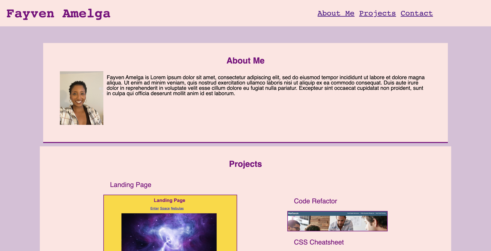

# Portfolio

## Technology Used 

| Technology Used         | Resource URL           | 
| ------------- |:-------------:| 
| HTML    | [https://developer.mozilla.org/en-US/docs/Web/HTML](https://developer.mozilla.org/en-US/docs/Web/HTML) | 
| CSS     | [https://developer.mozilla.org/en-US/docs/Web/CSS](https://developer.mozilla.org/en-US/docs/Web/CSS)      |   
| Git | [https://git-scm.com/](https://git-scm.com/)     |    

## Description 

[Visit the Deployed Site](https://famelga.github.io/Portfolio/)

To be considered as a good candidate for an open position, I have created an deployed a portfolio of work samples. 

To begin, I started with a wireframe to organize my homepage, as well as my html code. I found that labeling tags on my wireframe made it easier to format which tags to use in my html code since I knew where to place content.

I was able to link titles in the navigation bar to corresponding sections through the use of hrefs and id selectors. Similarily, deploy links to prior work were linked to images by linking hrefs with the deploy links to the matchign images. 

In CSS, I created a variable for the color purple since that color would be used on most texts. If I decide to change my primary color, I could easily apply this change from purple to my new color by adjusting only the one variable code. 

While there were some formatting issues with html, most of my challenges arised in CSS- particularily, flexboxes. I had misunderstood divs to be irrelevant in html code since they are not specific; however, they are essential to creating sections within html that can be styled by flexboxes in css. After multiple trial-and-error of positions, aligning, displays, I was finally able to get flexboxes to properly style my sections by adding divs to html. Divs allowed for parent, child, and sibling boxes to exist and use flex display. 

Once I was able to add the flex properties use divs, it was more simple to use media queries for responsive layouts that adapt to varying viewports.

Ultimately, I learned the importance of divs in relation to flexboxes. 


## Code Refactor Example

What are the steps required to install your project? Provide a step-by-step description of how to get the development environment running.


```html
<div class="header">
        <h1>Hori<span class="seo">seo</span>n</h1>
        <div>
            <ul>
                <li>
                    <a href="#search-engine-optimization">Search Engine Optimization</a>
                </li>
                <li>
                    <a href="#online-reputation-management">Online Reputation Management</a>
                </li>
                <li>
                    <a href="#social-media-marketing">Social Media Marketing</a>
                </li>
            </ul>
        </div>
    </div>
```

Converting the above non-semantic div with the class of 'header' to an appropriate [<header> semantic element](https://www.w3schools.com/html/html5_semantic_elements.asp). 

```html
<header>
        <h1>Hori<span class="seo">seo</span>n</h1>
        <nav>
            <ul>
                <li>
                    <a href="#search-engine-optimization">Search Engine Optimization</a>
                </li>
                <li>
                    <a href="#online-reputation-management">Online Reputation Management</a>
                </li>
                <li>
                    <a href="#social-media-marketing">Social Media Marketing</a>
                </li>
            </ul>
        </nav>
    </header>

```

This change require some additional modification to the CSS selector: 

```css
.header {
    padding: 20px;
    font-family: 'Trebuchet MS', 'Lucida Sans Unicode', 'Lucida Grande', 'Lucida Sans', Arial, sans-serif;
    background-color: #2a607c;
    color: #ffffff;
}
```

No longer targeting the element on the page with the class of 'header' but instead the css selector targeting the 'header' element 

```css
header {
    padding: 20px;
    font-family: 'Trebuchet MS', 'Lucida Sans Unicode', 'Lucida Grande', 'Lucida Sans', Arial, sans-serif;
    background-color: #2a607c;
    color: #ffffff;
}

```

## Usage 

Visit website.





## Learning Points 


This is a good place to Explain what you Learned by creating this application.
This is a great way to remind about all of the Complex Skills you now have.
If the user is less experienced than you:
They will be impressed by what you can do!

If the user is more experienced than you:
They will be impressed by what you can do!

Remember, it is easy to forget exactly how Valuable and Impressive your skills are, as well as How Much You’ve Learned!
So quantify that here!


## Author Info

### Fayven Amelga 


* [Portfolio](https://famelga.github.io/Portfolio/)
* [LinkedIn](https://www.linkedin.com/in/fayven-amelga-b09b17b6/)
* [Github](https://github.com/famelga)


## Credits

List your collaborators, if any, with links to their GitHub profiles.

If you used any third-party assets that require attribution, list the creators with links to their primary web presence in this section.

If you followed tutorials, include links to those here as well.


## License

MIT License

Copyright (c) 2022 Fayven Amelga

Permission is hereby granted, free of charge, to any person obtaining a copy
of this software and associated documentation files (the "Software"), to deal
in the Software without restriction, including without limitation the rights
to use, copy, modify, merge, publish, distribute, sublicense, and/or sell
copies of the Software, and to permit persons to whom the Software is
furnished to do so, subject to the following conditions:

The above copyright notice and this permission notice shall be included in all
copies or substantial portions of the Software.

THE SOFTWARE IS PROVIDED "AS IS", WITHOUT WARRANTY OF ANY KIND, EXPRESS OR
IMPLIED, INCLUDING BUT NOT LIMITED TO THE WARRANTIES OF MERCHANTABILITY,
FITNESS FOR A PARTICULAR PURPOSE AND NONINFRINGEMENT. IN NO EVENT SHALL THE
AUTHORS OR COPYRIGHT HOLDERS BE LIABLE FOR ANY CLAIM, DAMAGES OR OTHER
LIABILITY, WHETHER IN AN ACTION OF CONTRACT, TORT OR OTHERWISE, ARISING FROM,
OUT OF OR IN CONNECTION WITH THE SOFTWARE OR THE USE OR OTHER DEALINGS IN THE
SOFTWARE.

## Badges


---

© 2022 Trilogy Education Services, LLC, a 2U, Inc. brand. Confidential and Proprietary. All Rights Reserved.